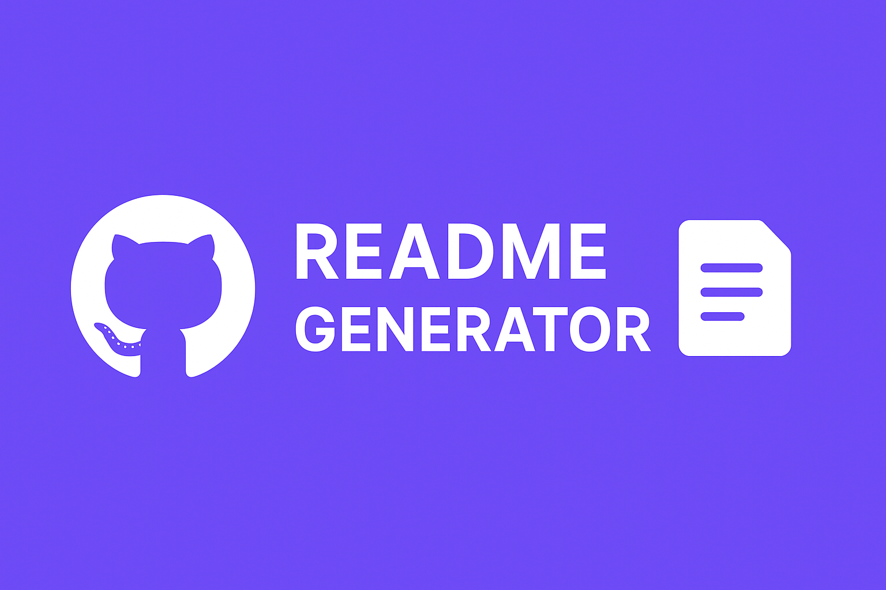
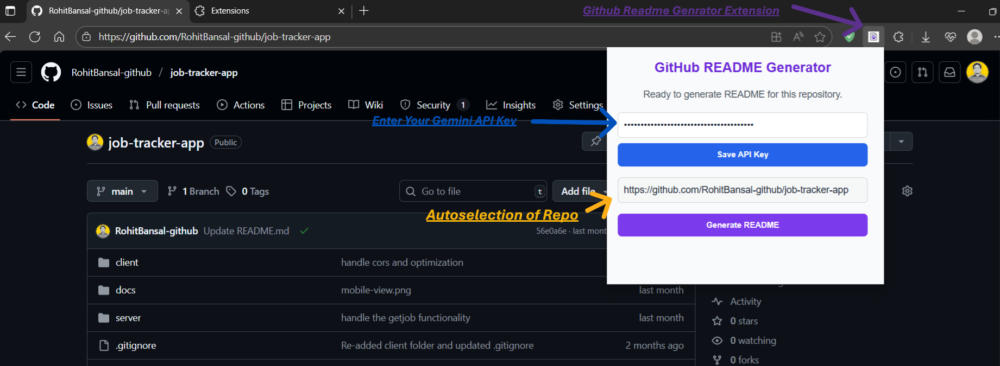
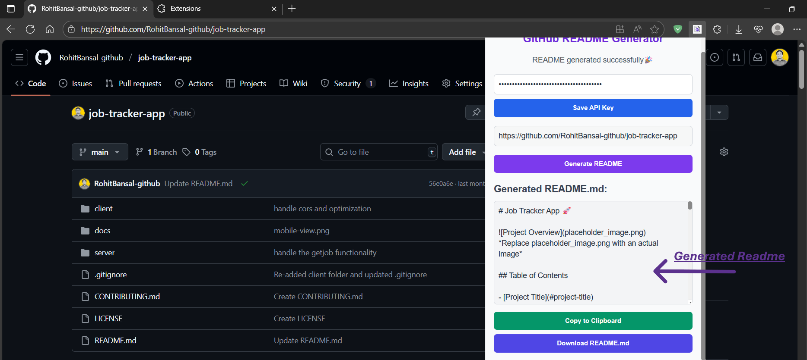
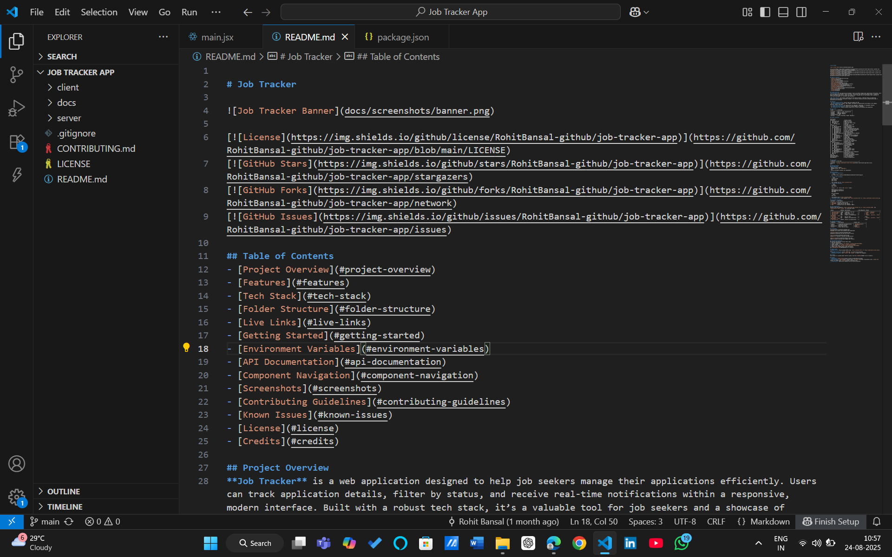

# GitHub README Generator 🚀


## Description

This project is a Chrome extension that leverages the Gemini AI model to generate professional README.md files for GitHub repositories.  It simplifies the process of creating well-structured and informative README files, saving developers time and effort. The target users are developers who want to quickly and easily generate high-quality README files for their GitHub projects.


## Table of Contents

- [Project Title](#project-title)
- [Description](#description)
- [Features](#features)
- [Technologies Used](#technologies-used)
- [Project Structure](#project-structure)
- [Setup Instructions](#setup-instructions)
- [Usage](#usage)
- [Screenshots](#screenshots)
- [Contributing](#contributing)
- [Contact Info](#contact-info)


## Features

* Generates a complete and well-formatted README.md file.
* Uses Markdown tables, bullet points, and other formatting for clarity.
* Infers whether the project is full-stack and if it has APIs.
* Includes sections for project overview, features, technologies, setup instructions, usage, screenshots, examples, API documentation, contributing guidelines, and contact information.
* Integrates with Gemini AI for advanced README generation.
* Provides a user-friendly Chrome extension interface.
* Allows saving and loading of Gemini API keys.
* Enables copying and downloading of the generated README.md.


## Technologies Used

*  `JavaScript`
*  `HTML`
*  `CSS`
*  `Google Gemini API`
*  `Chrome Extension`


## Project Structure

The project is structured as a Chrome extension with the following key files and folders:

```
├── background.js          // Main logic for README generation
├── manifest.json         // Extension manifest file
├── popup.html             // User interface for the extension
├── popup.js              // JavaScript for the extension's UI
└── icons/                 // Folder containing extension icons
```

## Setup Instructions

1. **Clone the repo:**  `git clone <repository_url>`
2. **Install dependencies:**  This project does not have external dependencies outside of the Google Gemini API.  You'll need a Gemini API key to use the extension functionality.
3. **Configure environment variables:** You need a valid Gemini API Key.  Enter this key into the extension's popup.
4. **Run the extension:** Load the unpacked extension in Chrome (Extensions -> Developer mode -> Load unpacked).


## Usage

1. Open a GitHub repository page in your Chrome browser.
2. Open the extension popup.
3. Enter your Gemini API Key (if not saved).
4. Click the "Generate README" button.
5. The generated README.md will be displayed in the extension popup.  You can copy or download the file.

## Screenshots

| Image                      | Description                                                                        |
|---------------------------|------------------------------------------------------------------------------------|
|  | Extension popup showing the input fields and generated README                     |
|  | Example of the generated README file displayed within the extension           |
|   | Example of a downloaded README.md file                                    |


## Contributing

Contributions are welcome! Please open an issue or submit a pull request if you find any bugs or have any suggestions for improvement.


## Contact Info

For any questions or support, please contact:  rohitbansal7364@gmail.com
